# ondacase

`ondacase` is a small detective game written in Prolog, Ink, and Fennel.

  

## Premise - Case 001

### The iced americano at 7:22

Eli Venn is dead in the back booth of Café Lantern.
Five people had reason to want him dead.
One of them is definitely lying alright.

### Features

- Four places to inspect and five people to question.
- Thirteen evidence records on a live timeline.
- A board to hold evidence and work out the connections.
- Theory and accusation tools with more than one ending.

## Screenshots

Everything below was captured in-game.
Older captures are still in the folder for comparison.
The full sets are in the [console gallery](screenshots/console/README.md) and the [spaces gallery](screenshots/spaces/README.md).

### Case file

  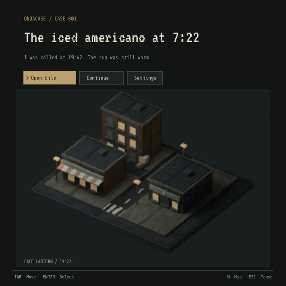

  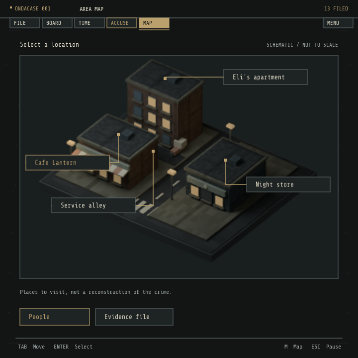
  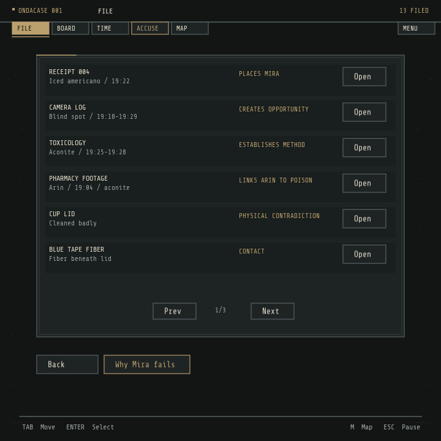

### The cast

  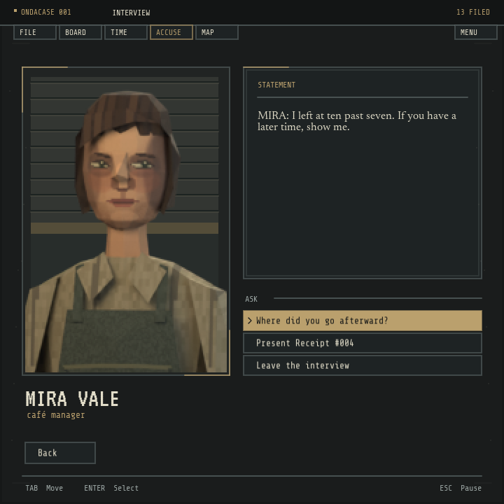
  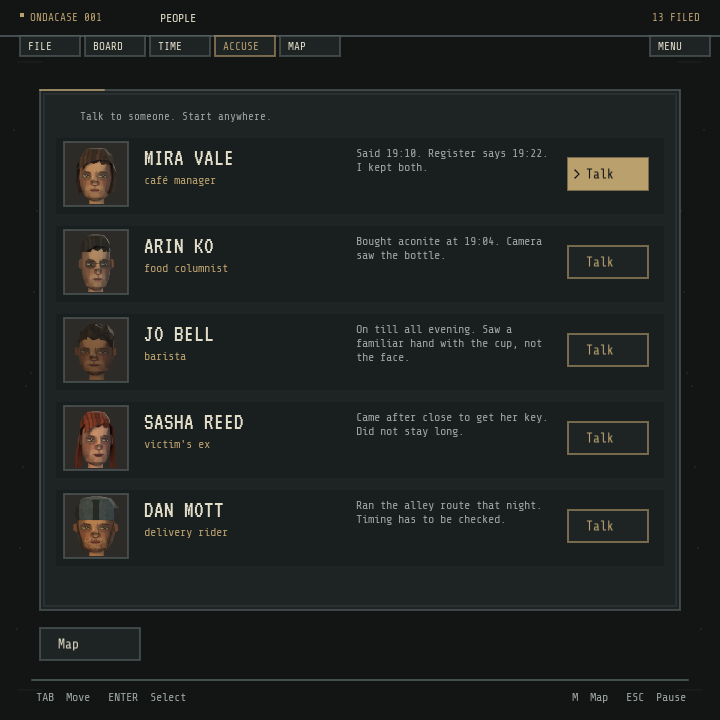

  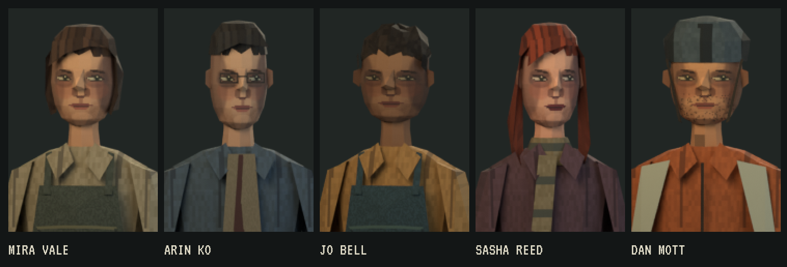

### Locations

  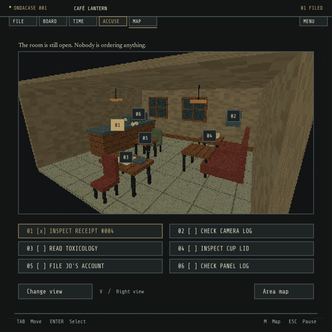

  
  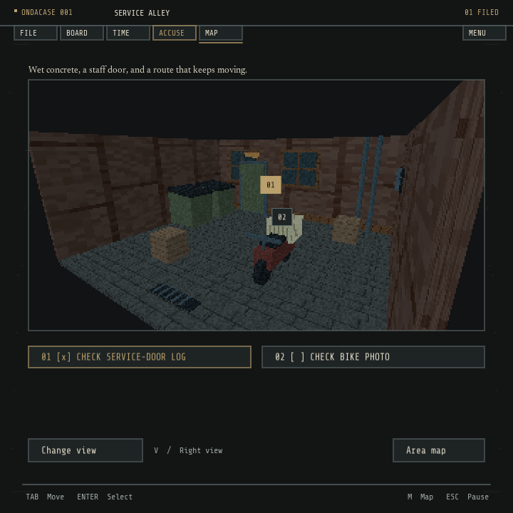

  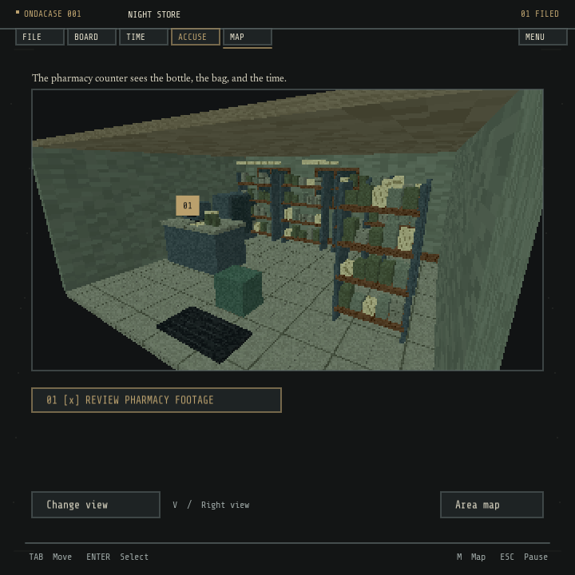
  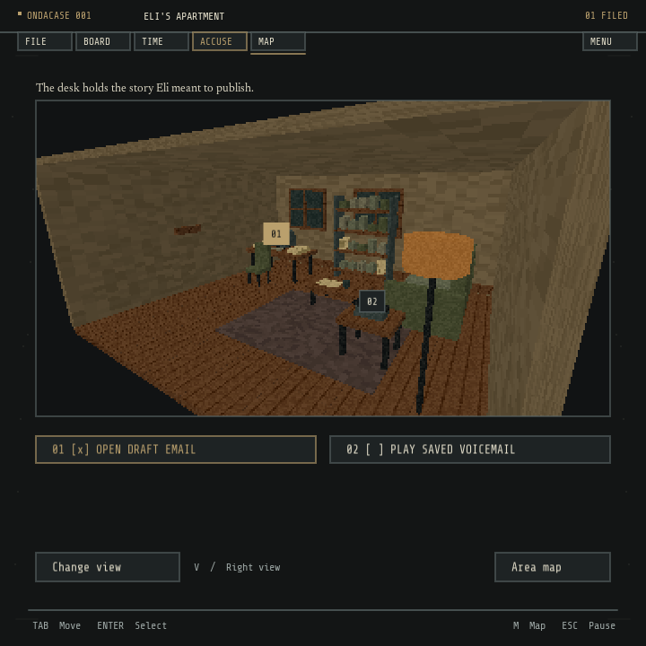

### UI

  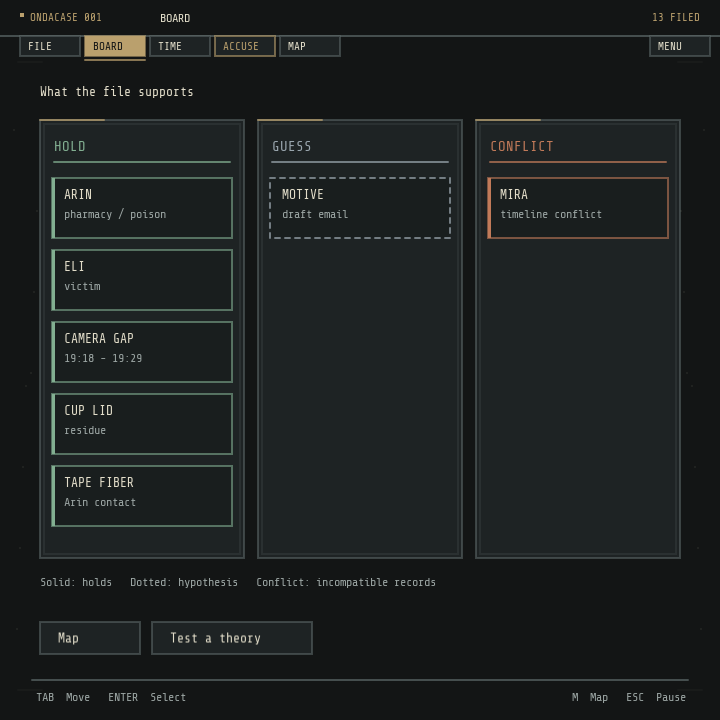
  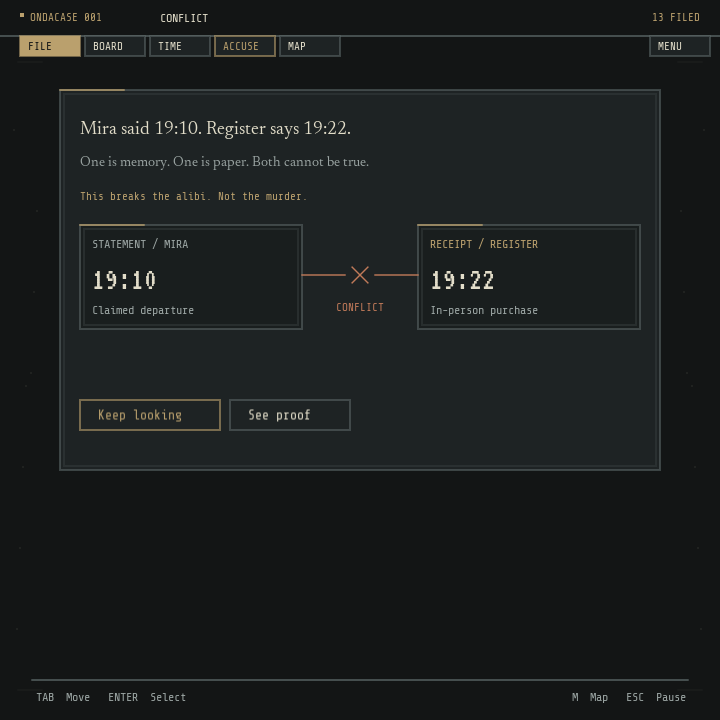

  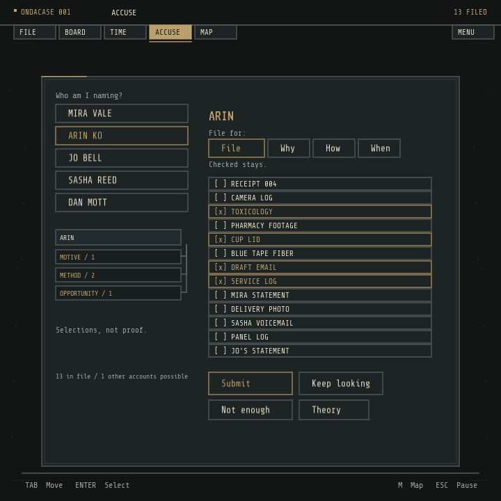
  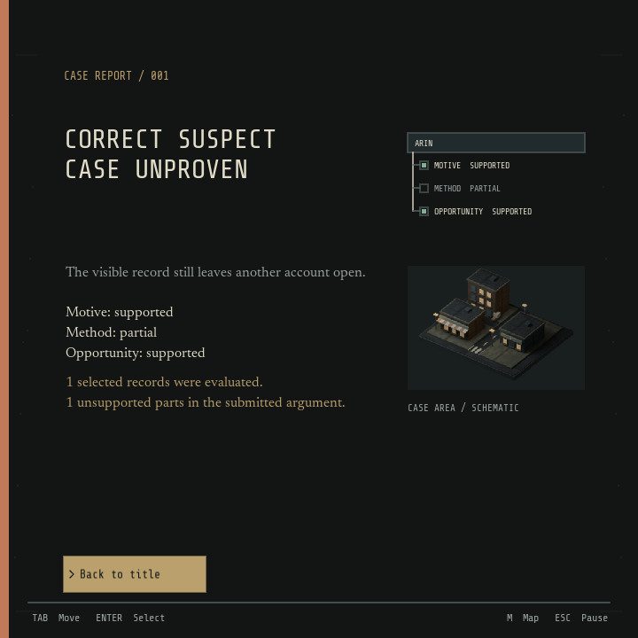

## Stack

| Language | Job |
|---|---|
| Ink | Dialogue, reactions, and conversation branches |
| Fennel | The LÖVE runtime, game state, rendering, input, saves, and bridge calls |
| Prolog | Case truth, inference, contradictions, proof trees, alternatives, and accusation evaluation |

## Development

Setup, controls, save behavior, verification commands, and the repository map live in the [development guide](GUIDE.md).
Presentation rules are in [`DESIGN.md`](DESIGN.md), and the current build plan is in [`PLAN.md`](PLAN.md).

The current raster artwork has no embedded author or license metadata.
See [`assets/README.md`](assets/README.md) before distributing a build.
