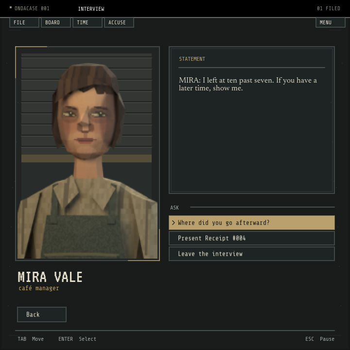

# Mira visual checkpoint

Status: implemented and self-verified for art-direction approval, not the completed five-character overhaul.
Date: 2026-09-06.



## Acceptance

| Criterion | Evidence |
|---|---|
| Rough PS1 character, actual low-poly geometry | Original 648-triangle model, named meshes in `mira.blend` |
| Low-resolution texture and portrait | 128×128 atlas; 144×216 portrait; nearest sampling at 2× in the reference interview |
| Console-style interview | Inset blue-grey panels, sodium selection strip, chevron, VT323 name, Share Tech Mono controls |
| Readable text at smaller sizes | Native 600×600, 720×720, and 1080×720 captures inspected; text uses linear filtering and is drawn after scanlines |
| Keyboard and mouse still work | First conversation action receives focus; click mapping, six-choice pagination, and original Ink choice indexes tested |
| Missing new asset is safe | Runtime test removes the new portrait and verifies the old portrait is drawn instead |
| Editable, reproducible assets | Blender script rerun successfully; packed atlas and relative paths retained in the blend file |
| Preserve gameplay boundaries | No Ink, Prolog, save, or logical-layout sources edited |

## Scoped changes

All project files were already untracked on entry, so there is no useful tracked baseline diff or commit range.
No files were staged or committed.

- `src/main.fnl`: interview layout, console control styling, portrait preference/filtering, font sampling, first-action focus, non-overlapping pagination.
- `src/main.lua`: regenerated through `make build`, never manually edited.
- `tools/test-runtime.lua`: portrait loading/filtering/fallback, text filtering, focus, and pagination regression coverage.
- `tools/test-fennel-runtime.lua`: native font-filter method reflected in the test double.
- `tools/render-mira.py`: original geometry, texture painter, lighting, camera, and offline export.
- `assets/suspects/mira-psx.png` and `assets/suspects/mira-source/`: portrait, editable model, atlas, provenance, and this packet.
- `assets/README.md` and `DESIGN.md`: provenance and checkpoint art direction.
- `screenshots/mira-psx-checkpoint.png`: fresh native game capture.

## Verification commands and output

Commands run from the repository root unless noted.

| Command | Output / result |
|---|---|
| `blender --background --python tools/render-mira.py` | `mira_portrait=pass triangles=648 atlas=128x128 portrait=144x216`; rerun passed |
| `make build` | `ondacase_build=pass`; Fennel compilation and Lua syntax validation |
| `make runtime-test` | `console_portrait_and_focus=pass`, `overflow_readable=pass`, `love_runtime_smoke=pass`, `fennel_runtime=pass`; both suites pass |
| `make check` | Doctor, build, all 51 Prolog tests, bridge, validator, Ink runtime, and 31 Ink routes passed; then failed on the pre-existing missing `/tmp/ondacase-ink.lua` fixture |
| `npm audit --omit=dev --audit-level=high` | `found 0 vulnerabilities` |
| `jq empty cases/001-americano/case.json` | Exit 0 |
| `jq empty story/main.json` | Exit 0 |
| `jq '.issues \| length' story/main.json` | `0` |

The existing Fennel/Ink test also passed when its obsolete temporary path was redirected in memory to the current generated bridge.
No test source or bridge was modified for this workaround:

```sh
lua -e 'package.path=package.path..";./vendor/share/lua/5.5/?.lua"; local original=dofile; dofile=function(path) return original(path=="/tmp/ondacase-ink.lua" and "src/ink.lua" or path) end; dofile("tools/test-fennel-ink.lua")'
# fennel_ink_bridge=pass
```

Native visual probe:

```sh
love /var/folders/9y/7rq1m85530g4lqfvfhckm0880000gn/T/opencode/ondacase-visual
# native_authored_text=pass lines=224 max_wrapped_lines=5
# native_ink_menu=pass choices=7
# native_visual=pass captures=7 sizes=720x720,600x600,1080x720
```

The disposable probe uses native LÖVE font/image decoding and rendering, and the real Ink bridge.
It feeds asset bytes around LÖVE's external-directory mount restriction.
Its captures include actual Mira choices, page two, hover, and reduced motion.
The authored-text check measures 224 dialogue/prose source lines in the five character scripts, not arbitrary 5,000-character bridge responses.

Recreate the checkpoint screenshot with the normal game entry point:

```sh
ONDACASE_CAPTURE=dialogue ONDACASE_CAPTURE_PATH="$PWD/screenshots/mira-psx-checkpoint.png" love .
```

All started LÖVE jobs exited; the failed initial sandbox probe was also confirmed no longer running.

## Risks and stop point

- Medium risk: shared rendering helpers, font sampling, portrait initialization, and interview focus/layout changed.
  No public contract, persistence, authentication, or deduction rules changed.
- `make check` remains red until the unrelated Fennel/Ink fixture path is corrected.
  The in-memory workaround is supporting evidence, not a claim that the stock command passed.
- Blender 5.2 reports a `Material.use_nodes` deprecation warning for Blender 6.0.
  The documented 5.2 export succeeds.
- Legacy café/location artwork still has unresolved provenance; this original portrait does not clear those assets for distribution.
- The portrait is static and deliberately crude.
  The remaining cast, animation, and broader menu overhaul await approval of this image.
- No independent reviewer was invoked; this is a self-verification packet and an art-direction checkpoint, not release approval.
